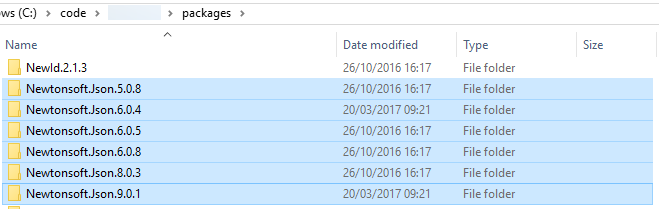

- title : Dependency Management done right!
- description : Introduction to PAKET
- author : Márcio Azevedo
- theme : night
- transition : default

***

## Dependency Management done right!

 
 

### Introduction to PAKET!

 
 

[Márcio Azevedo](https://github.com/marcio-azevedo/presentations/)

***

Back in the old days there was the ~\Libs\ folder...

...and when NuGet showed up, it made referencing a breeze.

--- 

But then, there was a new problem, instead of DLL Hell, there was

Note: NuGet (the command tool) works well for simple, small projects, not for complex and large ones!

---

### So, how can we solve it!?

***

#### PAKET - Dependency Manager for .NET (and Mono)

> **designed to work well with NuGet packages** and also
> enables referencing files directly from Git repositories or any HTTP resource.
> It enables **precise and predictable control** over what packages the projects within your application reference.

---

### Some References

* [ElasticSearch.NET](https://github.com/elastic/elasticsearch-net) uses this in their .NET tools and libraries
* [Jet.com](https://github.com/jet/kafunk) (recently acquired by Walmart by 3bn $)

***

### Why PAKET?

 

### PAKET offers **predictable control** over references with NuGet!

#### Here's some problems with NuGet command tool

---

#### NuGet has no concept of transitive dependencies

---

#### NuGet puts the package version in the path

---

#### Updates may require manual work (specially if you update framework)

***

#### Main components

* paket.exe (~/.paket directory in root)
* paket.dependencies (in solution root) - Global definition of dependencies
* paket.lock (generated from paket install) - List of used versions for all dependencies
* paket.references (in each project folder) - Dependency definition per project, "replaces" packages.config
* paket.template - Package definition for new packages

***

### Thank you!

* https://github.com/marcio-azevedo/presentations
