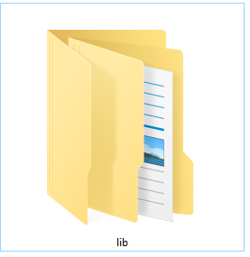

- title : Dependency Management done right!
- description : Introduction to PAKET
- author : Márcio Azevedo
- theme : night
- transition : default

***

## Dependency Management done right!

 
 

### Introduction to PAKET!

 
 

[Márcio Azevedo](https://github.com/marcio-azevedo/presentations/)

***

Back in the old days there was the ~\Libs\ folder...

...and when NuGet showed up, it made referencing a breeze.

--- 

But then, there was a new problem, instead of DLL Hell, there was

Note: NuGet (the command tool) works well for simple, small projects, not for complex and large ones!

---

### So, how can we solve it!?

***

#### PAKET - Dependency Manager for .NET (and Mono)

> **designed to work well with NuGet packages** and also
> enables referencing files directly from Git repositories or any HTTP resource.
> It enables **precise and predictable control** over what packages the projects within your application reference.

***

#### Main components

***

### Thank you!

* https://github.com/marcio-azevedo/presentations
