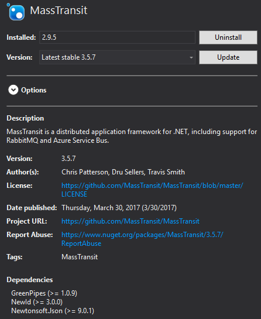
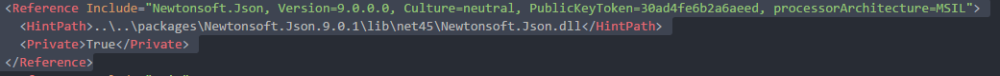
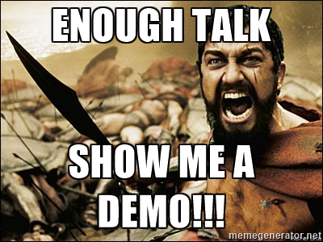

- title : Dependency Management done right!
- description : Introduction to PAKET
- author : Márcio Azevedo
- theme : night
- transition : default

***

## Dependency Management done right!

 
 

### Introduction to PAKET!

 
 

[Márcio Azevedo](https://github.com/marcio-azevedo/presentations/)

***

Back in the old days...

' there was the ~\Libs\ folder

...and when NuGet showed up, it made referencing a breeze.

--- 

But then, there was a new problem...
' instead of DLL Hell, there was

' Note: NuGet (the command tool) works well for simple, small projects, not for complex and large ones!

---

### So, what's the solution!?

<!---->

***

### PAKET
#### Dependency Manager for .NET (and Mono)

> **designed to work well with NuGet packages** and also
> enables referencing files directly from Git repositories or any HTTP resource.
' Why PAKET?
' PAKET offers **predictable control** over references with NuGet!
> It enables **precise and predictable control** over what packages the projects within your application reference.

---

' Here's some problems with NuGet command tool
### NuGet (the command tool) has no concept of transitive dependencies

---

### NuGet puts the package version in the path

' Problems: path to packages changes at every update, code reviews are harder because you're always updating csproj files, etc

---

### Updates may require manual work (specially if you update framework)

' Neither Visual Studio neither NuGet are clever to update it when you change the project Framework.

***

#### Main components

* paket.exe (~/.paket directory in root)
* paket.dependencies (in solution root) - Global definition of dependencies
* paket.lock (generated from paket install) - List of used versions for all dependencies
* paket.references (in each project folder) - Dependency definition per project, "replaces" packages.config
* paket.template - Package definition for new packages

***

### Some References

* [ElasticSearch.NET](https://github.com/elastic/elasticsearch-net) uses this in their .NET tools and libraries
* [Jet.com](https://github.com/jet/kafunk) (e-commerce platform recently acquired by Walmart by 3bn $)

---

---

### RECAP

* Plain text over Command line tool
* Direct vs. transitive dependencies
* Only one version of a package

There's also a VS extension - [Paket.VisualStudio](https://github.com/hmemcpy/Paket.VisualStudio)

---

#### Paket - Project Principles:

* Integrate well into the existing NuGet ecosystem
* Make things work with minimal tooling (plain text files)
* Make it work on all platforms
* Automate everything
* Create a nice community

***

## Thank you!

* Presentation Source: https://github.com/marcio-azevedo/presentations
* Gists: https://gist.github.com/marcio-azevedo/9576969640a404fd2944aab89117d212

* References:
    * https://fsprojects.github.io/Paket/
    * https://russcam.github.io/paket-fake-talk/#/intro
    * http://forki.github.io/PaketIntro/#/
