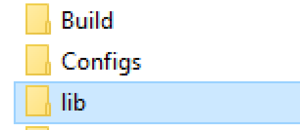
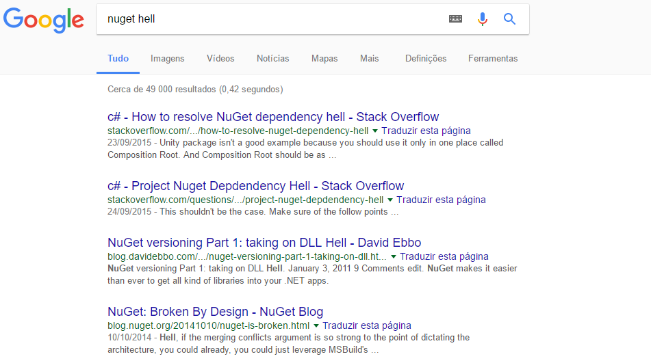

- title : Dependency Management done right!
- description : Introduction to PAKET
- author : Márcio Azevedo
- theme : night
- transition : default

***

## Dependency Management done right!

<br />
<br />

### Introduction to PAKET!

<br />
<br />

[Márcio Azevedo](https://github.com/marcio-azevedo/presentations/)

***

Back in the old days...

' there was the ~\Libs\ folder



...and when NuGet showed up, it made referencing a breeze.

--- 

But then, there was a new problem...



' instead of DLL Hell, there was...
' ...and it's still a problem as we know at Basecone...
' Note: NuGet (the command tool) works well for simple, small projects, not for complex and large ones!

---

## So, what's the solution!?


<!---->

***

### PAKET
#### Dependency Manager for .NET (and Mono)


> **designed to work well with NuGet packages** and also
> enables referencing files directly from Git repositories or any HTTP resource.
' Why PAKET?
' PAKET offers **predictable control** over references with NuGet!
> It enables **precise and predictable control** over what packages the projects within your application reference.

---

' Here's some problems with NuGet command tool
### NuGet (the command tool) has no concept of transitive dependencies


---

### NuGet puts the package version in the path


' Problems: path to packages changes at every update, code reviews are harder because you're always updating .csproj files, etc

---

### Updates may require manual work (specially if you update framework)


How PAKET does it:


' Neither Visual Studio neither NuGet are clever to update it when you change the project Framework.

---

#### Paket fully supports Semantic Versioning, and, currently, NuGet doesn’t (NuGet currently only supports SemVer 1.0.0).

> NuGet does not support SemVer-compatible (v2.0.0) prerelease numbers with dot notation, as in 1.0.1-build.23. You can use a form like 1.0.1-build23 but this is always considered a pre-release version.

in [PreRelease Semantic Versioning](https://docs.microsoft.com/en-us/nuget/create-packages/prerelease-packages#semantic-versioning)

Plan to implement [SemVer 2.0.0 support](https://github.com/NuGet/Home/wiki/SemVer-2.0.0-support)

***

#### PAKET is composed by _paket.bootstrapper.exe_

* Don't need to commit paket.exe to your repository
* Bootstrapper is available for download - [Bootstrapper](https://github.com/fsprojects/Paket/releases/latest)
* Bootstrapper allows to download latest paket.exe
* Can be used for CI build or from inside Visual Studio


' Main components
' http://fsprojects.github.io/Paket/paket-simplify.html#Sample

---

### Paket.exe (~/.paket directory in root)

```sh
$ .paket\paket.exe --help
```


---

### Global definition of dependencies
**paket.dependencies** (in solution root)

    source https://dotnet.myget.org/F/dotnet-core/api/v3/index.json

    // Reference a nuget package
    nuget FSharp.Management
    // Reference a single file from GitHub
    github myRepo/aProject dependency.dll 

    // Shared dependencies
    nuget Newtonsoft.Json
    nuget FSharp.Core

    group Web
        nuget Fake.IIS
        nuget Suave

    group Database
        nuget FluentMigrator
        nuget SQLProvider

---

### List of used versions for all dependencies
**paket.lock** (generated from paket install)

    NUGET
      remote: https://api.nuget.org/v3/index.json
        Microsoft.Bcl (1.1.9) - framework: >= net45
          Microsoft.Bcl.Build (>= 1.0.14)
        Microsoft.Bcl.Build (1.0.21) - import_targets: false, framework: >= net45
        Microsoft.Net.Http (2.2.28) - framework: >= net45
          Microsoft.Bcl (>= 1.1.9)
          Microsoft.Bcl.Build (>= 1.0.14)
        NuGet.CommandLine (3.5)

---

### Dependency definition per project ("replaces" packages.config)
**paket.references** (in each project folder)

    Microsoft.Net.Http
    Newtonsoft.Json

---

### Package definition for new packages
**paket.template** replaces the need for nuspec file

    type file
    id Test.Paket.Package
    version 1.0
    authors Márcio Azevedo
    description
        description of this test package
    files
        src/Test.Paket.Package/bin/Debug ==> lib

[Detailed options](https://fsprojects.github.io/Paket/template-files.html)

***


### Some References

* [ElasticSearch.NET](https://github.com/elastic/elasticsearch-net) uses this in their .NET tools and libraries
* [Jet.com](https://github.com/jet/kafunk) (e-commerce platform recently acquired by Walmart by 3bn $)

***

' #### Convert from NuGet command
' [Convert from NuGet command](http://fsprojects.github.io/Paket/paket-convert-from-nuget.html)
' 
' 
' 
' [Here's a tutorial](https://fsprojects.github.io/Paket/convert-from-nuget-tutorial.html)

### DEMO


***

### RECAP

* Plain text over Command line tool
* Direct vs. transitive dependencies
* Only one version of a package

There's also a VS extension - [Paket.VisualStudio](https://github.com/hmemcpy/Paket.VisualStudio)

' 


---

## Q&A
#### Paket - Project Principles:

* Integrate well into the existing NuGet ecosystem
* Make things work with minimal tooling (plain text files)
* Make it work on all platforms
* Automate everything
* Create a nice community

' 

***

## Thank you!

* [Presentation Source](https://github.com/marcio-azevedo/presentations/tree/master/paket) based on [FsReveal](https://github.com/fsprojects/FsReveal)
* [Gists](https://gist.github.com/marcio-azevedo/9576969640a404fd2944aab89117d212)

* References:
    * https://fsprojects.github.io/Paket/
    * https://russcam.github.io/paket-fake-talk/#/intro
    * http://forki.github.io/PaketIntro/#/
